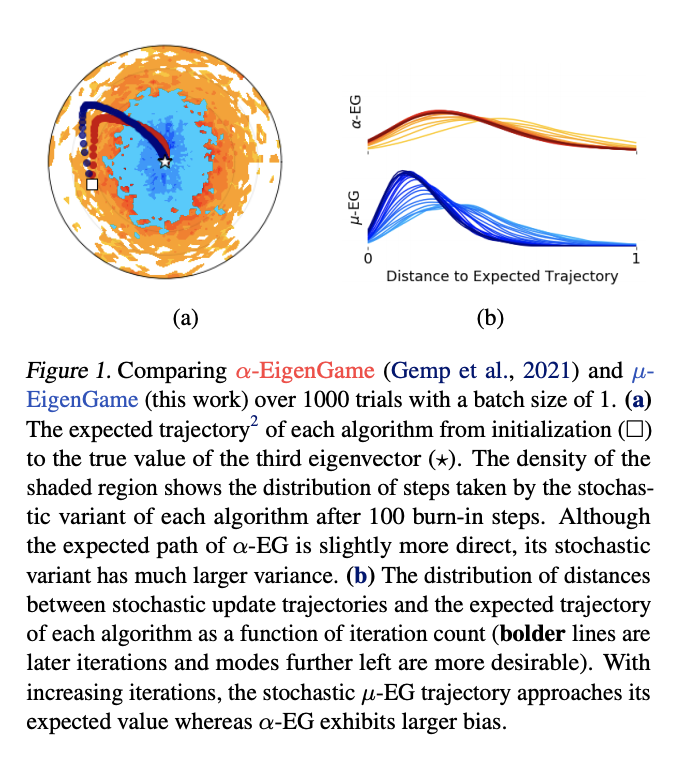

# EigenGame Unloaded: When playing games is better than optimizing

Port of Jax pseudocode from Appendix B of Deepmind's [EigenGame Unloaded: When playing games is better than optimizing](https://arxiv.org/abs/2102.04152). 

Requirements:
 - [optax](https://github.com/deepmind/optax)
 - [jaxline](https://github.com/deepmind/jaxline)




## Pseudocade

### Gradient and utility functions

```python
"""
Copyright 2020 DeepMind Technologies Limited. 


Licensed under the Apache License, Version 2.0 (the "License");
you may not use this file except in compliance with the License.
You may obtain a copy of the License at

https://www.apache.org/licenses/LICENSE-2.0

Unless required by applicable law or agreed to in writing, software
distributed under the License is distributed on an "AS IS" BASIS,
WITHOUT WARRANTIES OR CONDITIONS OF ANY KIND, either express or implied.
See the License for the specific language governing permissions and
limitations under the License.
"""

import jax
import optax
import jax.numpy as jnp

def eg_grads(vi: jnp.ndarray,
                weights: jnp.ndarray,
                eigs: jnp.ndarray,
                data: jnp.ndarray) -> jnp.ndarray:
    """
    Args:
     vi: shape (d,), eigenvector to be updated
     weights:  shape (k,), mask for penalty coefficients,
     eigs: shape (k, d), i.e., vectors on rows
     data: shape (N, d), minibatch X_t
    Returns:
     grads: shape (d,), gradient for vi
    """
  weights_ij = (jnp.sign(weights + 0.5) - 1.) / 2.  # maps -1 to -1 else to 0
  data_vi = jnp.dot(data, vi)
  data_eigs = jnp.transpose(jnp.dot(data,
                            jnp.transpose(eigs)))  # Xvj on row j
  vi_m_vj = jnp.dot(data_eigs, data_vi)
  penalty_grads = vi_m_vj * jnp.transpose(eigs)
  penalty_grads = jnp.dot(penalty_grads, weights_ij)
  grads = jnp.dot(jnp.transpose(data), data_vi) + penalty_grads
  return grads
  
def utility(vi, weights, eigs, data):
    """Compute Eigengame utilities.
    util: shape (1,), utility for vi
    """
  data_vi = jnp.dot(data, vi)
  data_eigs = jnp.transpose(jnp.dot(data, jnp.transpose(eigs)))  # Xvj on row j
  vi_m_vj2 = jnp.dot(data_eigs, data_vi)**2.
  vj_m_vj = jnp.sum(data_eigs * data_eigs, axis=1)
  r_ij = vi_m_vj2 / vj_m_vj
  util = jnp.dot(jnp.array(r_ij), weights)
  return util
```

### EigenGame Update functions
```python
def _grads_and_update(vi, weights, eigs, input, opt_state, axis_index_groups):
    """Compute utilities and update directions, psum and apply.
    Args:
     vi: shape (d,), eigenvector to be updated
     weights:  shape (k_per_device, k,), mask for penalty coefficients,
     eigs: shape (k, d), i.e., vectors on rows
     input: shape (N, d), minibatch X_t
     opt_state: optax state
     axis_index_groups: For multi-host parallelism https://jax.readthedocs.io/en/latest/_modules/jax/_src/lax/parallel.html 
    Returns:
     vi_new: shape (d,), eigenvector to be updated
     opt_state: new optax state
     utilities: shape (1,), utilities
    """
    grads, utilities = _grads_and_utils(vi, weights, V, input)
    avg_grads = jax.lax.psum(
        grads, axis_name='i', axis_index_groups=axis_index_groups)
    vi_new, opt_state, lr = _update_with_grads(vi, avg_grads, opt_state)
    return vi_new, opt_state, utilities

def _grads_and_utils(vi, weights, V, inputs):
    """Compute utiltiies and update directions ("grads"). 
        Wrap in jax.vmap for k_per_device dimension."""
    utilities = utility(vi, weights, V, inputs)
    grads = eg_grads(vi, weights, V, inputs)
    return grads, utilities
    
def _update_with_grads(vi, grads, opt_state):
    """Compute and apply updates with optax optimizer.
        Wrap in jax.vmap for k_per_device dimension."""
    updates, opt_state = self._optimizer.update(-grads, opt_state)
    vi_new = optax.apply_updates(vi, updates)
    vi_new /= jnp.linalg.norm(vi_new)
    return vi_new, opt_state
```    


### Skeleton for Jaxline experiment
```python
def init(self, *):
    """Initialization function for a Jaxline experiment."""
    weights = np.eye(self._total_k) * 2 - np.ones((self._total_k, self._total_k))
    weights[np.triu_indices(self._total_k, 1)] = 0.
    self._weights = jnp.reshape(weights, [self._num_devices,
                                          self._k_per_device, 
                                          self._total_k])
                                          
    local_rng = jax.random.fold_in(jax.random.PRNGkey(seed), jax.host_id())
    keys = jax.random.split(local_rng, self._num_devices)
    V = jax.pmap(lambda key: jax.random.normal(key, (self._k_per_device, self._dims)))(keys)
    self._V = jax.pmap(lambda V: V / jnp.linalg.norm(V, axis=1, keepdims=True))(V)    
        
    # Define parallel update function. If k_per_device is not None, wrap individual functions with vmap here.
    self._partial_grad_update = functools.partial(
        self._grads_and_update, axis_groups=self._axis_index_groups)
    self._par_grad_update = jax.pmap(
        self._partial_grad_update, in_axes=(0, 0, None, 0, 0, 0), axis_name='i')
        
    self._optimizer = optax.sgd(learning_rate=1e-4, momentum=0.9, nesterov=True)

def step(self, *):
    """Step function for a Jaxline experiment"""
    inputs = next(input_data_iterator)
    self._local_V = jnp.reshape(self._V, (self._total_k, self._dims))  
    self._V, self._opt_state, utilities, lr = self._par_grad_update(
        self._V, self._weights_jnp, self._local_V, inputs, self._opt_state,
        global_step)
```


All credit goes to the paper's authors and license follows what is included in the publication.
